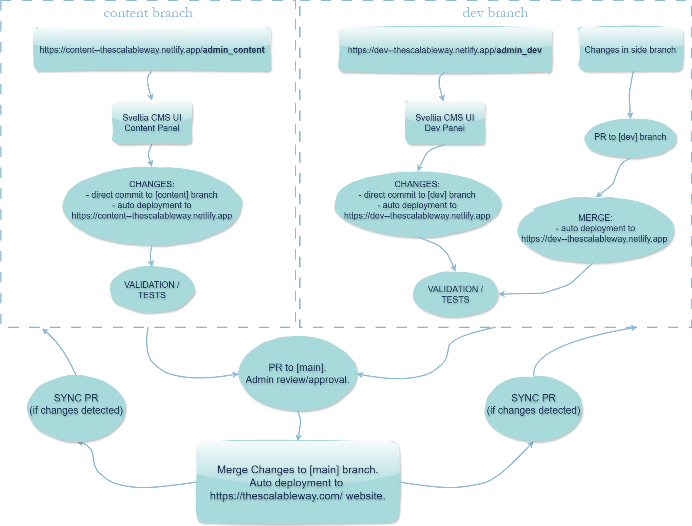

# The Scalable Way

### This repository contains a website `The Scalable Way` dyvenia division.

Deployed websites:
- Production is deployed from `main` branch and is available here: https://thescalableway.com/
- Dev is deployed from `dev` branch and is available here: https://dev--thescalableway.netlify.app/

---

### Blog Contribution Guidelines

Blog articles are markdown files inside the [`src/posts`](https://github.com/dyvenia/site-thescalableway/tree/main/src/posts) folder. The top of the markdown has a YAML section to define article metadata such as title, description and publish date.

**Code Blocks** are possible with the typical "```" opening and closing. Documentation on syntax highlighting and code blocks can be found [here](https://www.11ty.dev/docs/plugins/syntaxhighlight/).

**Images** should be stored in `src/images`.


### Adding New Pages / Templates

Create an issue on github with the `webdeveloper` tag so that the webdeveloper can resolve it.


### Theme Support

For support check: [eleventy-excellent](https://github.com/madrilene/eleventy-excellent).

---

### Local Development

This site uses a static page generator called `eleventy`, you can read its documentation [here](https://www.11ty.dev/).

If you have `npm` installed (if not, follow this [guide](https://www.sitepoint.com/npm-guide/)), you should be able to run the local version with the following command (in the root directory of the repository):
```bash
npm run start
```
Usually the local website will run on `http://127.0.0.1:8080/`.

---

### Development Workflow

* Implement changes by:
    * *FOR WEBSITE CHANGES*: 
    
      `admin` panel in Sveltia CMS UI (changes in Sveltia are pefromed directly to `dev` branch, you can enter admin panel using path: https://thescalableway.com/admin/).

      *Admin panel is deployed using Sveltia CMS. All admin configurations are in [`src/admin/config.yml`](https://github.com/dyvenia/site-thescalableway/blob/main/src/admin/config.yml).*

    * *FOR INFRASTRUCTURE CHANGES*:
    
       perfom changes directly in repo (PR/Merge to `dev` branch).

* Once the changes have been made and tested, create a PR to the main branch and assign one of the repository owners for review and approval.
* After merging the changes to the main branch, Netlify will automatically build and deploy the changes to the production website.


<p align="center">
  
</p>
